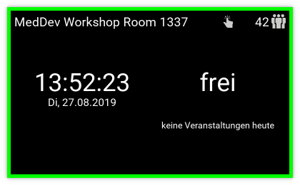

# Meeting-Room Display

MedDev team workshop 2018: A display system for showing meeting room reservations. A raspberry pi (raspi) with a touch display is used.



## Continuous integration

There are several tags that can be specified for updating the devices. See the list below for
detailed description of executed actions:

```installation```:
 - assert root partition has sufficient space
 - resize rootfs
 - dist-upgrade
 - apt-get update
 - install required debian packages
 - install required python packages (O365, Cython, kivy)
 - clone git repository
 - add cron entries
 - enable/start systemd services
 - set/replace kivy configuration

```deployment```:
 - apt-get update
 - clone git repository
 - restart systemd services
 - set/replace kivy configuration

```upgrade```:
 - dist-upgrade
 - apt-get update

```hotspot```:

```Warning: Just call this tag once. Before calling it, run "upgrade" to install required dependencies!```
 - clone git repository
 - install and configure hotspot mode

## Setting up a new device

* Log in on the raspi as user `pi` (password: `raspberry`)
  Attention: The keyboard layout might be set to American.

* Enter the raspi software configuration tool by typing
  `sudo raspi-config`

    * Enable SSH access to the raspi (5 Interfacing options -> P2 SSH)

    * Optional: Set hostname (2 Network options -> N1 Hostname)
        * Set to mrd-\<suffix\>, e.g., mrd-caprica
        * The raspi should be accessible in the network via IP address, the locally set hostname, or the name given by DHCP.

    * Optional: Set German keyboard layout (4 Localisation options -> I3 Change keyboard layout)

    * Optional: Set Wi-fi country so that Wi-fi can be used (4 Localisation options -> I4 Change Wi-fi country)

    * Optional: Set correct timezone (4 Localisation options -> I2 Change Timezone)

## Setting up the project for development on Linux (Ubuntu)

* Install kivy as described in https://kivy.org/docs/installation/installation-linux.html

* Install the python O365 library for interaction with Office 365:

    * Make sure the linux package for Python 3 pip is installed (python3-pip).
      If not, the pip command might work nevertheless, but might refer to the Python 3 pip command instead of the Python 2 pip command and cause errors.
        * Check if the package is installed: dpkg -s python-pip.
        * If not, install it: sudo apt-get install python-pip.

    * Install the Python O365 library:
      sudo pip install O365 (capital letter O)

* O365 Authentification Flow

    * To work with oauth you first need to register your application "Meeting_Room_Display" at [Microsoft Application Registration Portal](https://apps.dev.microsoft.com/).

        1. Login at [Microsoft Application Registration Portal](https://apps.dev.microsoft.com/)
        2. Create an app, note your app id (client_id) in the "mrd/configuration.ini"
        3. Generate a new password (client_secret) under "Application Secrets" section
        4. Under the "Platform" section, add a new Web platform and set "https://outlook.office365.com/owa/" as the redirect URL
        5. Under "Microsoft Graph Permissions" section, add the delegated permissions you want (see scopes), as an example, to read and write calendar use:
            1. Calendar.Read
            2. Calendar.ReadWrite

    * Then you need to login manually for the first time to get the access token by consenting the application to access the resources it needs.
    
        1. First get the authorization url.
            ```
            python3 -m scripts.generate_token
            ```
            
        2. The user must visit the given url and give consent to the application. When consent is given, the page will redirect to: "https://outlook.office365.com/owa/".
    
            Then the user must copy the resulting page url and give it to the connection object (copy the url to command line interface):
            This, if succesful, will store the token in a txt file on the project folder "mrd/o365_token.txt".
    
            <span style="color:red">Take care, the access token must remain protected from unauthorized users!</span>
    
        3. At this point you will have an access token that will provide valid credentials when using the api. If you change the scope requested, then the current token won't work, and you will need the user to give consent again on the application to gain access to the new scopes requested.
    
            The access token only lasts 60 minutes, but the app will automatically request new tokens through the refresh tokens, but note that a refresh token only lasts for 90 days. So you must use it before or you will need to request a new access token again (no new consent needed by the user, just a login).
        
            There is a periodic cronjob running once a day to update the refresh token.
    
            For further information about this process please read the [O365 API](https://github.com/O365/python-o365/#authentication).
